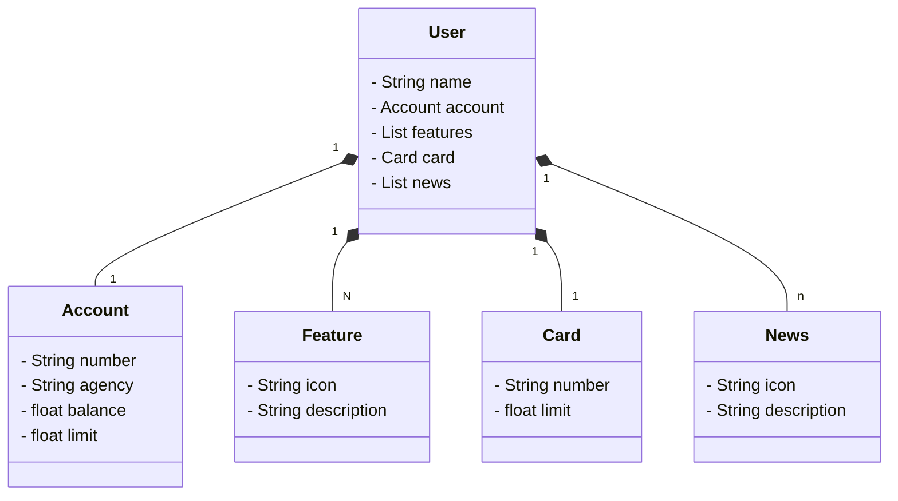

# Diagrama de classes com ChatGPT e Marmeid

# Estrutura em JSON

```
{
   "name":"José Américo",
   "acount":{
      "number":"000000000-9",
      "agency":"0000",
      "balance":1234.64,
      "limit":1000.00
   },
   "features":[
      {
         "icon":"URL",
         "description":"Descricão de Feature"
      }
   ],
   "card":{
      "number":"xxx xxxx xxxx 0000",
      "limit":1000.00
   },
   "news":[
      {
         "icon":"URL",
         "description":"Descrição de Novidade"
      }
   ]
}


```

# Diagrama de Classes


# JSON PARA TESTES

[Swagger-ui/index.html](http://localhost:8080/swagger-ui/index.html)
```
   {
  "id": 1,
  "name": "JOSE AMERICO",
  "account": {
    "id": 1,
    "number": "22311",
    "agency": "0091",
    "balance": 2000.65,
    "limit": 1300
  },
  "card": {
    "id": 1,
    "number": "666555888",
    "limit": 12
  },
  "features": [
    {
      "id": 1,
      "icon": "teste.png",
      "description": "Contas Gold!"
    }
  ],
  "news": [
    {
      "id": 1,
      "icon": "news.png",
      "description": "novo esquema de investimentos!"
    }
  ]
}


```
Configuramos um perfil para dev no arquivo application-dev.yml
Configuramos um perfil de produção e configuramos as variáveis de ambiente.
application-prod.yml
Utilizamos o [Railway](https://railway.app) Para persistir os dados com o PostgreSQL.

# Fazendo o deploy no Railwai

## Passo 1

- alterar arquivo no build.gradle
   
   ```
      task.jar{
         manifest {
            attributes["Main-Class"] = 'doichejunior.Application'
         }
      }
   ```

## Passo 2
- Criar o arquivo sem extensão Procfile na raiz

adicionar ao arquivo Procfile

```
              //[caminho]
web: jar -jar build/libs/santander-dev-week-2023-0.0.1-SNAPSHOT.jar

```


Para pegar o caminho entrar no Gradle --> build rodar o arquivo boot.jar 

abrir a pasta build --> libs o arquivo estará contido copiar o endereço dele para adicionar ao [caminho] do ProcFile (Path from Repository Root) Relative path

Assim o Railway identifica o caminho do .jar e realiza o task.

## Passo 3

Criar um Rack

Pode ser que o Railway não suporte o Gradle na versão 8xx então modificamos o gradle-wrapper.properties para 7.6.1 para funcionar.

Commitar as alterações incluindo os arquivos não versionados.